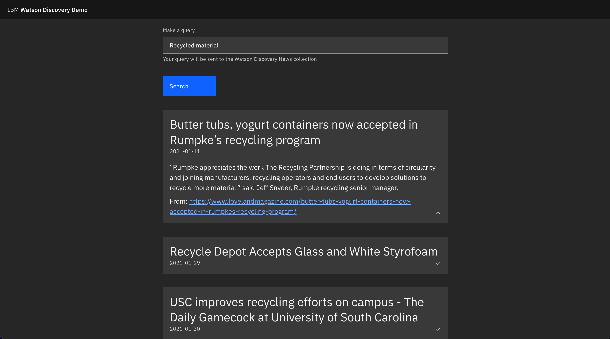

# Discovery Kubernetes Lab

## Introduction

In this lab, we will deploy a simple app on Kubernetes that serves a web app and communicates with Watson Discovery. The [UI app](./react-app) will be served by a Node.js back end running Fastify. The [back end](./server) will then make queries to Watson Discovery and return the results.

## Prerequisites

- Any non-lite type of [IBM Cloud](https://cloud.ibm.com/registration) account (you must upgrade to create a free Kubernetes cluster)
- [Docker](https://www.docker.com/)
- [IBM Cloud CLI](https://github.com/IBM-Cloud/ibm-cloud-cli-release#downloads)
- [Kubectl](https://v1-18.docs.kubernetes.io/docs/tasks/tools/install-kubectl/)

## Setup

Before we start, install the following IBM Cloud CLI plugins:

```
ibmcloud plugin install kubernetes-service
ibmcloud plugin install container-registry
```

Create a free 1 worker [IBM Kubernetes Service](https://cloud.ibm.com/kubernetes/catalog/create) cluster.

And finally, create a free [Watson Discovery](https://cloud.ibm.com/catalog/services/watson-discovery) instance.

## Step-by-step

This step-by-step guide assumes a Linux/Unix like shell usage. Slight adpatations might be necessary for different CLI shells.

### Step 1

Start by logging in to IBM Cloud:

```sh
ibmcloud login
```

### Step 2

Login to IBM Container Registry as well:

```sh
ibmcloud cr login
```

### Step 3

Add a namespace for your project at IBM Container Registry (ICR):

```sh
export ICR_NAMESPACE=<your_namespace>

ibmcloud cr namespace-add $ICR_NAMESPACE
```

### Step 4

Let's build the app. Build a Docker image for the app, tag and push it to ICR under your namespace:

```sh
export APP_IMAGENAME=us.icr.io/$ICR_NAMESPACE/discovery-demo-app:v1
docker build -t $APP_IMAGENAME .
docker push $APP_IMAGENAME
```

(building the image should take a few minutes)

### Step 5

Connect to your IBM Kubernetes Service (IKS) cluster:

```sh
ibmcloud ks cluster config --cluster <your_cluster_name>
```

The cluster name is the one you chose when creating it. In case you forgot, you can check that in the [IBM Cloud resource list](https://cloud.ibm.com/resources), under `Clusters`.

### Step 6

For our back end to make requests to Watson Discovery, it will need the Discovery instance credentials, which will be defined by two environment variables. We will create the credentials as a Kubernetes secret, then inject them in the app by configuring environment variables on the [deployment yaml file](./server/deployment.yaml). You can find your `APIKEY` and `URL` for Watson Discovery by going to your [IBM Cloud resource list](https://cloud.ibm.com/resources), and clicking on your Watson Discovery instance under `Services`. Store them in environment variables as below and create the secret:

```sh
export $DISCOVERY_APIKEY=<discovery_apikey>
export $DISCOVERY_URL=<discovery_url>

kubectl create secret generic discovery-credentials --from-literal=api-key=$DISCOVERY_APIKEY --from-literal=url=$DISCOVERY_URL
```

### Step 7

Now we will deploy our built image to Kubernetes. First, update the [deployment.yaml](./server/deployment.yaml) file to match your image name. You should update the line 24's image value - updating just the namespace will do just fine. After doing that, we can deploy:

```sh
kubectl apply -f server/deployment.yaml
```

_In case you're wondering, the `deployment.yaml` file can be generated with `kubectl create deployment <deployment_name> --image=<image_name> --port <port> --dry-run=client -o yaml > deployment.yaml`. The yaml file we used is just additionally configured to use the secret as environment variables._

### Step 8

Our app should now be running. You can check that with `kubectl get pods`. If there are any errors, you can check the logs with `kubectl logs <pod_id>`. The next step is to expose our app publicly, so we can access it. Let's do that:

```sh
kubectl expose deploy discovery-demo-app --type=NodePort
```

A Node Port will be created and it will forward the pod's exposed port to the node's public interface

### Step 9

Ok! Now your app is ready to be publicly accessed! We will do that by getting the cluster worker node's public IP and accessing the port forwarded by the Node Port. First, run:

```sh
kubectl get svc
```

You should see the discovery-demo-app `NodePort` and some columns of information. With a free cluster, you can't have an external IP for your service yet, but you can access the service through the worker node's public IP. You can find the TCP port forwarded by the Node Port in the above command's output. It should look something like `8080:<port>/TCP`, being a port in the range `30000 - 32767`.

Take note of the port. You will use it to access the app.

### Step 10

Get your worker node's public IP. You can do that by running the following command:

```sh
ibmcloud ks worker ls <your_cluster_name> # Cluster name is same as in step 5
```

That will output the ID of the worker in your cluster, together with its public and private IPs. Copy the public IP as we will use it next.

### Step 11

Access the app! The URL should be formatted like this: `http://<worker_ip>:<node_port>`. You can access it directly from your browser and see the magic happen. Try out a couple of queries for Watson Discovery news!


